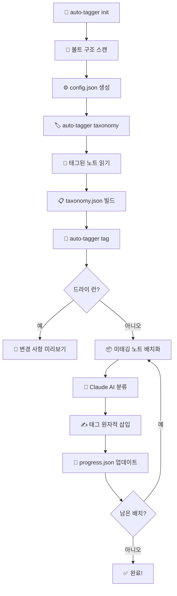

<div align="center">

# 🏷️ Obsidian Auto Tagger

**AI 기반 Obsidian 볼트 자동 태깅 — 설정 파일 하나로, 하드코딩 없이.**

[](https://python.org)
[](https://anthropic.com)
[](https://obsidian.md)

[**English README**](README.md)

---

*볼트를 지정하면, 구조를 파악하고, 알아서 태깅합니다.*

</div>

## ✨ 이게 뭘 하는 건가요?

Obsidian Auto Tagger는 볼트의 구조를 스캔하고, **Claude AI**로 태그가 없는 노트를 분류한 뒤, 안전하게 태그를 삽입합니다.

```
  ┌──────────────┐     ┌───────────────┐     ┌───────────────┐     ┌────────────┐
  │  볼트 구조    │────▶│ 설정 & 택소노미 │────▶│   Claude AI   │────▶│ 태그 삽입   │
  │  자동 스캔    │     │   자동 생성     │     │   노트 분류    │     │  안전 기록   │
  └──────────────┘     └───────────────┘     └───────────────┘     └────────────┘
```

### 적용 전 vs 적용 후

```markdown
# 적용 전 — 태그 없는 노트 😔
---
title: 반도체 전쟁
source: Chip War by Chris Miller
---

글로벌 칩 패권을 둘러싼 전쟁...
```

```markdown
# 적용 후 — 자동 태깅 완료! ✅
---
title: 반도체 전쟁
source: Chip War by Chris Miller
---
#topic/Technology #topic/Geopolitics #theme/SupplyChain #theme/Innovation

글로벌 칩 패권을 둘러싼 전쟁...
```

## 🎯 주요 기능

| 기능 | 설명 |
|:-----|:-----|
| 🔍 **자동 감지** | 볼트를 스캔해서 디렉토리, 태그 접두사, 택소노미 소스를 자동으로 파악 |
| 🤖 **AI 분류** | Claude Haiku 또는 Sonnet이 각 노트에 가장 적합한 태그를 선택 |
| 🏷️ **커스텀 접두사** | `#topic/`, `#theme/`에 국한되지 않음 — `#category/`, `#priority/` 등 무엇이든 가능 |
| 🔄 **멱등성** | 두 번 실행해도 동일한 결과. 태그 중복 절대 없음 |
| 💾 **원자적 쓰기** | 임시 파일 → 이름 변경 방식으로 노트가 절대 반쯤 쓰이지 않음 |
| ⏸️ **이어하기** | 중간에 중단됐어도 마지막 지점부터 재개 가능 |
| 🏃 **배치 처리** | 노트를 묶어서 API를 효율적으로 사용 |
| 👀 **드라이 런** | 파일을 수정하기 전에 모든 변경 사항을 미리보기 |
| 🆕 **새 태그 제안** | 택소노미에 없는 태그를 제안하고 `[NEW]`로 표시 |

## 🤔 기존 플러그인과 뭐가 다른가요?

Obsidian 커뮤니티에는 [Auto Classifier](https://github.com/HyeonseoNam/auto-classifier)와 [Metadata Auto Classifier](https://github.com/GoBeromsu/Metadata-Auto-Classifier) 같은 좋은 플러그인이 있습니다. 이들은 Obsidian 안에서 **노트 하나씩** 태깅하는 데 적합합니다. 이 도구는 다른 문제를 풉니다.

|  | Obsidian 플러그인 | Auto Tagger |
|:--|:--|:--|
| **실행 방식** | Obsidian 내부 (GUI) | CLI — Obsidian 밖에서 실행 |
| **처리 범위** | 노트 하나씩, 수동 실행 | **볼트 전체**를 한 번의 명령으로 |
| **AI** | OpenAI / Ollama / Jina AI | Claude (Haiku 또는 Sonnet) |
| **택소노미** | 참조 어휘 없음 | 기존 태그에서 택소노미를 구축하고 일관된 분류에 활용 |
| **배치 처리** | ❌ | ✅ 노트를 묶어서 효율적으로 API 호출 |
| **이어하기** | ❌ | ✅ 중단된 지점부터 재개 |
| **드라이 런** | ❌ | ✅ 쓰기 전에 모든 변경 사항 미리보기 |
| **안전성** | 플러그인에 따라 다름 | 원자적 쓰기, 멱등성, 라인 수 검증 |
| **자동 감지** | 수동 설정 | 볼트 구조를 스캔해서 설정을 자동 생성 |

**한줄 요약** — 플러그인은 **인터랙티브 도구** ("노트 열기 → 클릭 → 태그 받기")이고, Auto Tagger는 **배치 자동화 도구** ("볼트 지정 → 전부 태깅")입니다. 태그 안 달린 노트가 수백 개라면, 플러그인으로는 감당이 안 됩니다.

## 🚀 빠른 시작

### 1. 설치

```bash
git clone https://github.com/your-username/obsidian-auto-tagger.git
cd obsidian-auto-tagger
pip install -e ".[dev]"
```

### 2. API 키 설정

```bash
echo "ANTHROPIC_API_KEY=sk-ant-..." > .env
```

> 💡 Anthropic API 키는 [console.anthropic.com](https://console.anthropic.com)에서 발급받을 수 있습니다.

### 3. 초기화

```bash
auto-tagger init /path/to/your/vault
```

볼트를 스캔하고 `config.json`을 생성합니다:

```
Scanning vault: /path/to/your/vault
Detecting structure...

Detected 2 tag prefixes: ['topic', 'theme']
Detected 4 note directories:
  10. Literature (label: literature)
  00. Inbox (label: inbox)
  3. Resources (label: resources)
  40. Zettelkasten (label: zettelkasten)
Taxonomy source: 10. Literature

Saved config to: config.json
```

### 4. 택소노미 추출

```bash
auto-tagger taxonomy
```

가장 많이 태깅된 디렉토리에서 `taxonomy.json`을 빌드합니다. AI가 이것을 참조 태그 목록으로 사용합니다.

### 5. 태깅 실행

```bash
# 먼저 미리보기 (항상 권장!)
auto-tagger tag --dry-run

# 확인 후 실제 실행
auto-tagger tag
```

### 6. 통계 확인

```bash
auto-tagger stats
```

```
Total notes: 842
Tagged: 623
Untagged: 219

Top 10 Topics:
  Economics: 87
  Technology: 64
  Philosophy: 52
  ...
```

## ⚙️ 설정 (config.json)

`init` 명령이 자동 생성하며, 수동으로 편집할 수 있습니다.

```jsonc
{
  "vault_path": "/absolute/path/to/vault",

  // 사용할 태그 접두사 — 원하는 이름 자유롭게
  "tag_prefixes": ["topic", "theme"],

  // 노트가 있는 디렉토리
  "note_directories": [
    {
      "path": "10. Literature",
      "label": "literature",
      "content_strategy": "structured"
    },
    {
      "path": "00. Inbox",
      "label": "inbox",
      "content_strategy": "body_text"
    }
  ],

  // 태그가 가장 많이 달린 디렉토리 (택소노미 추출 소스)
  "taxonomy_source": "10. Literature",

  // 태그 라인 삽입 위치 (레이블별 폴백)
  "tag_line_fallbacks": { "literature": 9, "inbox": 8 },

  // 선택적 튜닝
  "content_max_chars": 2000,
  "embed_only_threshold": 50,
  "model": "haiku",
  "batch_size": 10
}
```

### 설정 필드 상세

| 필드 | 타입 | 설명 |
|:-----|:-----|:-----|
| `vault_path` | `string` | Obsidian 볼트 루트의 절대 경로 |
| `tag_prefixes` | `string[]` | 태그 카테고리 (예: `["topic", "theme", "priority"]`) |
| `note_directories` | `object[]` | 처리할 디렉토리 목록 — 각각 `path`, `label`, `content_strategy` 포함 |
| `taxonomy_source` | `string` | 택소노미 추출에 사용할 디렉토리 (이미 태그가 잘 달린 곳) |
| `tag_line_fallbacks` | `object` | 레이블별 태그 라인 기본 위치 |
| `content_max_chars` | `int` | AI에 전송할 노트당 최대 글자 수 (기본: `2000`) |
| `embed_only_threshold` | `int` | 실제 텍스트가 이 값 미만이면 "임베드 전용" 노트로 판별 (기본: `50`) |
| `model` | `string` | `"haiku"` (빠르고 저렴) 또는 `"sonnet"` (더 정확) |
| `batch_size` | `int` | API 호출당 노트 수 (기본: `10`) |

### 콘텐츠 전략

| 전략 | 동작 | 적합한 경우 |
|:-----|:-----|:-----------|
| `structured` | 섹션 헤더(`##`, `#`)를 건너뛰고 본문만 전송 | 구조화된 제목이 있는 문헌 노트 |
| `body_text` | 태그 라인 이후 모든 내용을 전송 | 자유 형식 글, 인박스 노트 |

## 🔧 CLI 명령어

```
사용법: auto-tagger [COMMAND]

Commands:
  init      볼트를 스캔하고 config.json 생성
  taxonomy  설정된 소스에서 태그 택소노미 추출
  tag       AI로 노트를 분류하고 태그 삽입
  stats     태깅 통계 표시
```

### `auto-tagger init <vault_path>`

| 옵션 | 설명 |
|:-----|:-----|
| `--output PATH` | config.json 출력 경로 지정 |

### `auto-tagger tag`

| 옵션 | 설명 |
|:-----|:-----|
| `--dry-run` | 파일 수정 없이 미리보기만 |
| `--resume` | 마지막 진행 상태에서 이어서 실행 |
| `--batch-size N` | 배치 크기 오버라이드 |
| `--model [haiku\|sonnet]` | AI 모델 오버라이드 |
| `--path SUBFOLDER` | 특정 하위 폴더만 처리 |

## 🔒 안전 보장

노트를 절대 손상시키지 않도록 설계되었습니다:

```
                    ┌──────────────────────────────────┐
                    │          안전 파이프라인            │
                    ├──────────────────────────────────┤
                    │                                   │
  태그 삽입 ───────▶│  1. 임시 파일에 먼저 기록            │
                    │  2. 라인 수가 일치하는지 검증         │
                    │  3. 원자적 이름 변경 (os.replace)    │
                    │  4. 실패 시 원본 파일 그대로 유지      │
                    │                                   │
                    └──────────────────────────────────┘
```

- **멱등성**: 이미 있는 태그를 감지하고 절대 중복 삽입하지 않음
- **원자적 쓰기**: 임시 파일 + `os.replace()` — 부분 기록 없음
- **라인 수 검증**: 삽입 후 파일 구조가 보존되었는지 확인
- **PascalCase 정규화**: 모든 태그를 일관된 형식으로 변환

## ⚠️ 유의 사항

> **🔑 API 키 필요**
>
> Anthropic API 키가 필요합니다. [console.anthropic.com](https://console.anthropic.com)에서 발급하세요. Claude API 호출은 토큰당 과금됩니다 — Haiku가 Sonnet보다 훨씬 저렴합니다.

> **👀 반드시 Dry-Run 먼저**
>
> 실제 태깅 전에 항상 `auto-tagger tag --dry-run`을 실행하세요. 제안된 태그가 볼트에 맞는지 확인한 후 진행하세요.

> **📋 설정 파일 검토**
>
> `init` 후에는 반드시 `config.json`을 검토하세요. 자동 감지가 완벽하지 않을 수 있습니다 — 디렉토리 레이블, 접두사 추가/제거, 콘텐츠 전략 변경이 필요할 수 있습니다.

> **🔄 택소노미 품질이 중요**
>
> AI가 분류할 때 택소노미를 참조합니다. 택소노미가 풍부할수록 태깅이 일관됩니다. 볼트가 새로 시작한 것이라면, 먼저 대표적인 노트 10-20개를 수동으로 태깅하세요.

> **💰 비용 인지**
>
> 노트 10개당 약 1회 API 호출입니다. 500개 노트 볼트 기준 ~50회 API 호출이 예상됩니다. 비용 효율을 위해 `haiku`(기본값)를 사용하고, 분류 정확도가 필요할 때만 `sonnet`으로 전환하세요.

> **🔙 볼트 백업 필수**
>
> 원자적 쓰기와 멱등성을 보장하지만, 자동화 도구를 처음 실행하기 전에는 반드시 볼트를 백업하세요.

## 🗺️ 작동 원리



## 📁 프로젝트 구조

```
obsidian-auto-tagger/
├── auto_tagger/
│   ├── __init__.py          # 패키지 버전
│   ├── __main__.py          # python -m 진입점
│   ├── cli.py               # Click CLI 명령어
│   ├── config.py            # 설정 로드/저장/검증
│   ├── scanner.py           # 볼트 자동 감지
│   ├── taxonomy.py          # 태그 어휘 관리
│   ├── classifier.py        # Claude AI 배치 분류
│   ├── note_parser.py       # 마크다운 파싱 & 콘텐츠 추출
│   ├── tag_inserter.py      # 멱등적 태그 쓰기
│   └── progress.py          # 재개 가능한 진행 추적
├── tests/
│   ├── test_*.py            # 유닛 테스트
│   └── fixtures/            # 샘플 마크다운 파일
├── pyproject.toml
└── .env                     # ANTHROPIC_API_KEY (커밋 안 됨)
```

## 🧪 테스트

```bash
# 전체 테스트 실행
pytest tests/ -v

# 특정 모듈 테스트
pytest tests/test_classifier.py -v
```

## 📄 라이선스

MIT

</div>
