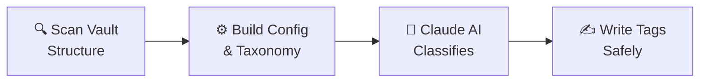
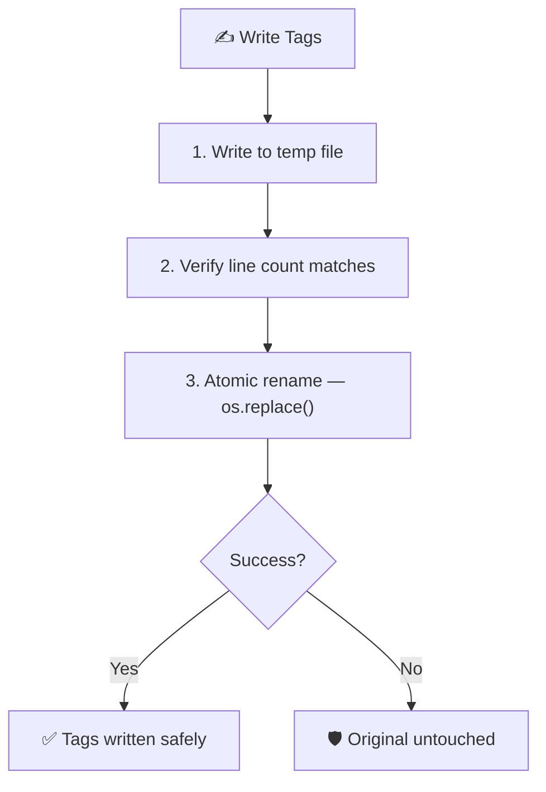
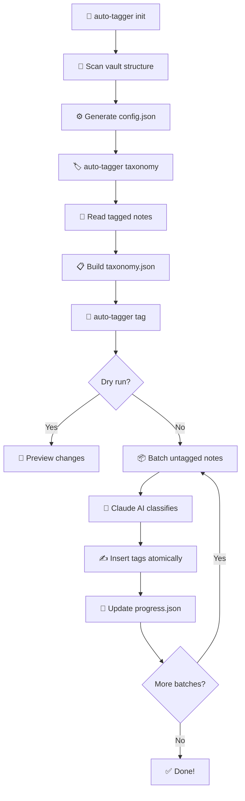

<div align="center">

# 🏷️ Obsidian Auto Tagger

**AI-powered tagging for any Obsidian vault — fully config-driven, zero hardcoding.**

[](https://python.org)
[](https://anthropic.com)
[](https://obsidian.md)

[**한국어 README**](README.ko.md)

---

*Point it at your vault. It scans, learns, and tags — automatically.*

</div>

> **📢 Looking for the Claude Code version?**
>
> The core functionality of this tool has been integrated into [**Obsidian Vault Doctor**](https://github.com/your-username/obsidian-vault-doctor) as a built-in skill. Vault Doctor uses Claude Code's deliberate reasoning (instead of Haiku/Sonnet API calls) for higher tagging quality, unified configuration via `vault-rules.json`, and no API key management. If you use Claude Code, Vault Doctor is the recommended way to auto-tag your vault.
>
> This standalone Python CLI remains available for users who prefer a lightweight, API-based approach.

## ✨ What It Does

Obsidian Auto Tagger reads your vault, understands its structure, and uses **Claude AI** to classify every untagged note with the right tags — then writes them back, safely.



### Before & After

```markdown
# Before — your untagged note
---
title: The Semiconductor Wars
source: Chip War by Chris Miller
---

The global battle for chip supremacy...
```

```markdown
# After — auto-tagged! ✅
---
title: The Semiconductor Wars
source: Chip War by Chris Miller
---
#topic/Technology #topic/Geopolitics #theme/SupplyChain #theme/Innovation

The global battle for chip supremacy...
```

## 🎯 Key Features

| Feature | Description |
|:--------|:------------|
| 🔍 **Auto-Detection** | Scans your vault to discover directories, tag prefixes, and taxonomy sources |
| 🤖 **AI Classification** | Claude Haiku or Sonnet picks the best tags for each note |
| 🏷️ **Custom Prefixes** | Not limited to `#topic/` and `#theme/` — use `#category/`, `#priority/`, anything |
| 🔄 **Idempotent** | Run it twice, get the same result. Never duplicates tags |
| 💾 **Atomic Writes** | Temp file + rename — your notes never get half-written |
| ⏸️ **Resumable** | Crashed mid-run? Resume exactly where you left off |
| 🏃 **Batch Processing** | Groups notes into batches for efficient API usage |
| 👀 **Dry Run** | Preview every change before touching a single file |
| 🆕 **New Tag Proposals** | Suggests tags not in your taxonomy, marked with `[NEW]` |

## 🤔 How Is This Different from Existing Plugins?

There are great Obsidian plugins like [Auto Classifier](https://github.com/HyeonseoNam/auto-classifier) and [Metadata Auto Classifier](https://github.com/GoBeromsu/Metadata-Auto-Classifier). They work well for tagging **one note at a time** inside Obsidian. This tool solves a different problem.

|  | Obsidian Plugins | Auto Tagger |
|:--|:--|:--|
| **How it runs** | Inside Obsidian (GUI) | CLI — runs outside Obsidian |
| **Scope** | One note at a time, manually triggered | **Entire vault** in one command |
| **AI** | OpenAI / Ollama / Jina AI | Claude (Haiku or Sonnet) |
| **Taxonomy** | No reference vocabulary | Builds a taxonomy from your existing tags and uses it for consistent classification |
| **Batch** | ❌ | ✅ Groups notes for efficient API calls |
| **Resume** | ❌ | ✅ Picks up where it left off |
| **Dry run** | ❌ | ✅ Preview all changes before writing |
| **Safety** | Plugin-dependent | Atomic writes, idempotency, line count verification |
| **Auto-detection** | Manual config | Scans vault structure and generates config automatically |

**TL;DR** — Plugins are **interactive tools** ("open note → click → get tags"). Auto Tagger is a **batch automation tool** ("point at vault → tag everything"). If you have hundreds of untagged notes, plugins won't cut it.

## 🚀 Quick Start

### 1. Install

```bash
git clone https://github.com/your-username/obsidian-auto-tagger.git
cd obsidian-auto-tagger
pip install -e ".[dev]"
```

### 2. Set your API key

```bash
echo "ANTHROPIC_API_KEY=sk-ant-..." > .env
```

### 3. Initialize

```bash
auto-tagger init /path/to/your/vault
```

This scans your vault and generates `config.json`:

```
Scanning vault: /path/to/your/vault
Detecting structure...

Detected 2 tag prefixes: ['topic', 'theme']
Detected 4 note directories:
  10. Literature (label: literature)
  00. Inbox (label: inbox)
  3. Resources (label: resources)
  40. Zettelkasten (label: zettelkasten)
Taxonomy source: 10. Literature

Saved config to: config.json
```

### 4. Extract taxonomy

```bash
auto-tagger taxonomy
```

Builds `taxonomy.json` from your most-tagged directory — the AI uses this as reference.

### 5. Tag your notes

```bash
# Preview first (always recommended!)
auto-tagger tag --dry-run

# When satisfied, run for real
auto-tagger tag
```

### 6. Check stats

```bash
auto-tagger stats
```

```
Total notes: 842
Tagged: 623
Untagged: 219

Top 10 Topics:
  Economics: 87
  Technology: 64
  Philosophy: 52
  ...
```

## ⚙️ Configuration

`config.json` is the single source of truth. Generated by `init`, editable by hand.

```jsonc
{
  "vault_path": "/absolute/path/to/vault",

  // Tag prefixes to use — any names you want
  "tag_prefixes": ["topic", "theme"],

  // Which directories contain notes
  "note_directories": [
    {
      "path": "10. Literature",
      "label": "literature",
      "content_strategy": "structured"
    },
    {
      "path": "00. Inbox",
      "label": "inbox",
      "content_strategy": "body_text"
    }
  ],

  // Directory with the most pre-tagged notes (used to build taxonomy)
  "taxonomy_source": "10. Literature",

  // Where to insert tag line (fallback per label)
  "tag_line_fallbacks": { "literature": 9, "inbox": 8 },

  // Optional tuning
  "content_max_chars": 2000,
  "embed_only_threshold": 50,
  "model": "haiku",
  "batch_size": 10
}
```

### Config Fields

| Field | Type | Description |
|:------|:-----|:------------|
| `vault_path` | `string` | Absolute path to Obsidian vault root |
| `tag_prefixes` | `string[]` | Tag categories (e.g., `["topic", "theme", "priority"]`) |
| `note_directories` | `object[]` | Directories to process, each with `path`, `label`, `content_strategy` |
| `taxonomy_source` | `string` | Directory with canonical tagged notes for taxonomy extraction |
| `tag_line_fallbacks` | `object` | Fallback tag line positions per label |
| `content_max_chars` | `int` | Max characters sent to AI per note (default: `2000`) |
| `embed_only_threshold` | `int` | Notes with fewer chars of real text are "embed-only" (default: `50`) |
| `model` | `string` | `"haiku"` (fast/cheap) or `"sonnet"` (more accurate) |
| `batch_size` | `int` | Notes per API call (default: `10`) |

### Content Strategies

| Strategy | Behavior | Best For |
|:---------|:---------|:---------|
| `structured` | Skips section headers, sends only body text | Literature notes with structured headings |
| `body_text` | Sends everything after the tag line | Inbox notes, free-form writing |

## 📁 Project Structure

```
obsidian-auto-tagger/
├── auto_tagger/
│   ├── __init__.py          # Package version
│   ├── __main__.py          # python -m entry point
│   ├── cli.py               # Click CLI commands
│   ├── config.py            # Config load/save/validate
│   ├── scanner.py           # Vault auto-detection
│   ├── taxonomy.py          # Tag vocabulary management
│   ├── classifier.py        # Claude AI batch classification
│   ├── note_parser.py       # Markdown parsing & content extraction
│   ├── tag_inserter.py      # Idempotent tag writing
│   └── progress.py          # Resume-capable progress tracking
├── tests/
│   ├── test_*.py            # Unit tests
│   └── fixtures/            # Sample markdown files
├── pyproject.toml
└── .env                     # ANTHROPIC_API_KEY (not committed)
```

## 🔧 CLI Reference

```
Usage: auto-tagger [COMMAND]

Commands:
  init      Scan a vault and generate config.json
  taxonomy  Extract tag taxonomy from configured source
  tag       Classify and tag notes using AI
  stats     Show tagging statistics
```

### `auto-tagger init <vault_path>`

| Option | Description |
|:-------|:------------|
| `--output PATH` | Custom output path for config.json |

### `auto-tagger tag`

| Option | Description |
|:-------|:------------|
| `--dry-run` | Preview changes without modifying files |
| `--resume` | Resume from last progress |
| `--batch-size N` | Override batch size |
| `--model [haiku\|sonnet]` | Override AI model |
| `--path SUBFOLDER` | Process only a specific subfolder |

## 🔒 Safety Guarantees

Obsidian Auto Tagger is designed to never corrupt your notes:



- **Idempotent**: Existing tags are detected and never duplicated
- **Atomic writes**: Uses temp file + `os.replace()` — no partial writes
- **Line count check**: Validates that file structure is preserved after insertion
- **PascalCase normalization**: All tags are consistently formatted

## ⚠️ Important Notes

> **🔑 API Key Required**
>
> You need an Anthropic API key. Get one at [console.anthropic.com](https://console.anthropic.com). Claude API calls are billed per token — Haiku is significantly cheaper than Sonnet.

> **👀 Always Dry-Run First**
>
> Run `auto-tagger tag --dry-run` before any real tagging session. Review the proposed tags to make sure they make sense for your vault.

> **📋 Review Your Config**
>
> After `init`, always review `config.json`. The auto-detection is good but not perfect — you may want to adjust directory labels, add/remove prefixes, or change content strategies.

> **🔄 Taxonomy Quality Matters**
>
> The AI references your taxonomy when classifying. A richer taxonomy = more consistent tagging. If your vault is new with few tagged notes, consider manually tagging 10-20 representative notes first.

> **💰 Cost Awareness**
>
> Each batch of 10 notes ≈ one API call. For a 500-note vault, expect ~50 API calls. Use `haiku` (default) for cost efficiency; switch to `sonnet` only when classification accuracy needs improvement.

> **🔙 Backup Your Vault**
>
> While the tool uses atomic writes and is idempotent, always back up your vault before running any automated tool on it for the first time.

## 🧪 Testing

```bash
# Run all tests
pytest tests/ -v

# Run a specific test module
pytest tests/test_classifier.py -v
```

## 🗺️ How It Works



## 📄 License

Licensed under the [Apache License, Version 2.0](LICENSE).

</div>
